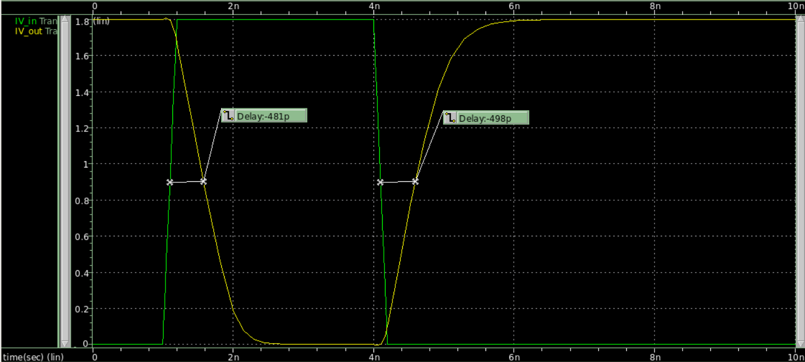

## TIME DELAY WAVEFORM

## DELAY TABLE

|  Capacitance (fF)  |  Rising Delay (ps)  |  Falling Delay (ps)  |  Error (% Difference)  |
|     :-------:      |      :------:       |      :-------:       |        :------:        |
|  1  |  27.1  |  45.2  |  66.79  |
|  5  |  57.7  |  74.5  |  29.12  |
|  10  |  85.8  |  101  |  17.72  |
|  20  |  131  |  144  |  9.92  |
|  25  |  153  |  166  |  8.50  |
|  30  |  175  |  188  |  7.43  |
|  40  |  219  |  232  |  5.94  |
|  50  |  262  |  277  |  5.73  |
|  60  |  306  |  321  |  4.90  |
|  70  |  351  |  368  |  4.84  |
|  75  |  372  |  389  |  4.57  |
|  80  |  393  |  410  |  4.33  |
|  85  |  416  |  430  |  3.37  |
|  90  |  439  |  451  |  2.73  |
|  100  |  481  |  498  |  3.53  |

## SINK CAPACITANCE

