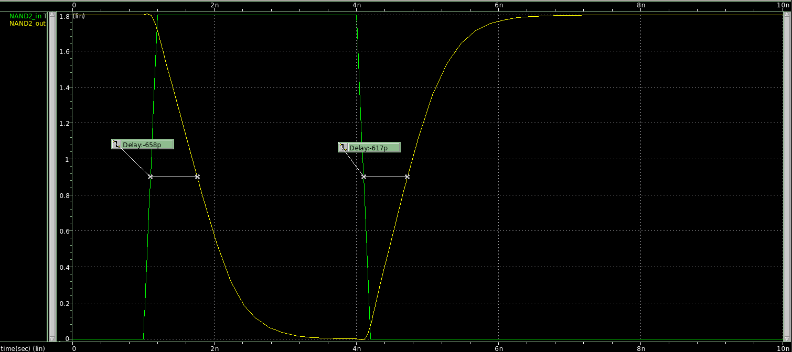
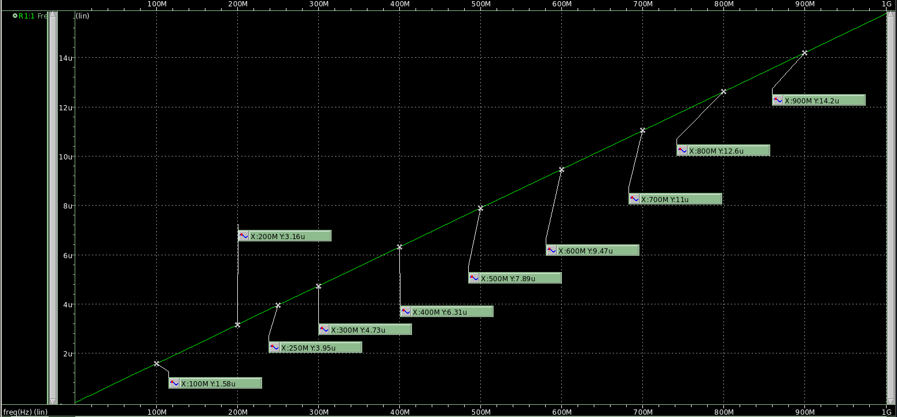

## TIME DELAY WAVEFORM

## DELAY TABLE

|  Capacitance (fF)  |  Rising Delay (ps)  |  Falling Delay (ps)  |  Error (% Difference)  |
|     :-------:      |      :------:       |      :-------:       |        :------:        |
|  1  |  38.6  |  54.9  |  42.23  |
|  5  |  74.8  |  87.2  |  16.58  |
|  10  |  109  |  116  |  6.42  |
|  20  |  170  |  172  |  1.18  |
|  25  |  200  |  200  |  0.00  |
|  30  |  232  |  227  |  2.20  |
|  40  |  293  |  284  |  3.17  |
|  50  |  353  |  341  |  3.52  |
|  60  |  416  |  395  |  5.32  |
|  70  |  476  |  451  |  5.54  |
|  75  |  506  |  478  |  5.86  |
|  80  |  536  |  505  |  6.14  |
|  85  |  567  |  535  |  5.98  |
|  90  |  598  |  562  |  6.41  |
|  100  |  658  |  617  |  6.65  |

## SINK CAPACITANCE

|  Frequency (MHz)  |  Ifrequency (uA)  |  Capacitance (fF)  |
|     :-------:     |      :------:     |      :-------:     |
|  100  |  1.58  |  2.515  |
|  200  |  3.16  |  2.515  |
|  250  |  3.95  |  2.515  |
|  300  |  4.73  |  2.509  |
|  400  |  6.31  |  2.511  |
|  500  |  7.89  |  2.511  |
|  600  |  9.47  |  2.512  |
|  700  |  11.0  |  2.501  |
|  800  |  12.6  |  2.507  |
|  900  |  14.2  |  2.511  |
Sink Capacitance: 2.511fF
