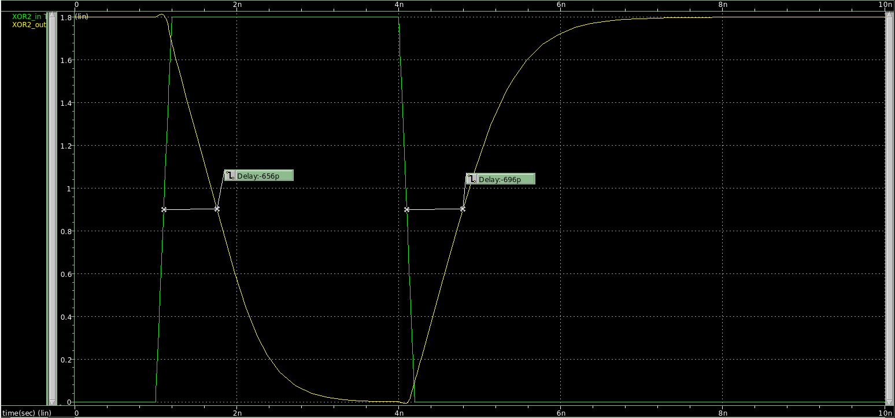
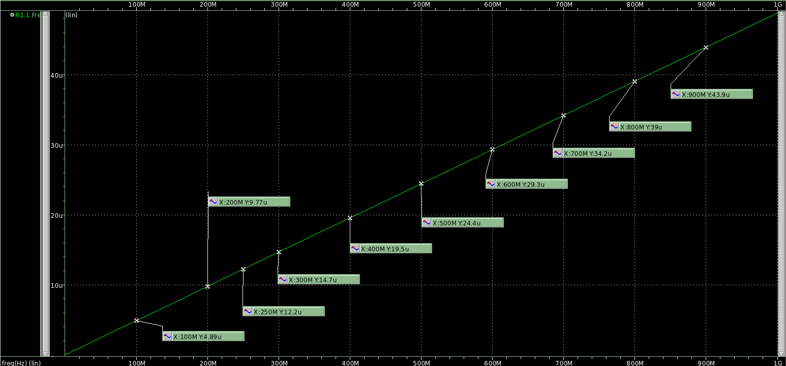

## TIME DELAY WAVEFORM

## DELAY TABLE

|  Capacitance (fF)  |  Rising Delay (ps)  |  Falling Delay (ps)  |  Error (% Difference)  |
|     :-------:      |      :------:       |      :-------:       |        :------:        |
|  1  |  41.3  |  51.3  |  24.21  |
|  5  |  70.4  |  81.7  |  16.05  |
|  10  |  103  |  117  |  13.59  |
|  20  |  166  |  182  |  9.64  |
|  25  |  197  |  214  |  8.63  |
|  30  |  228  |  247  |  8.33  |
|  40  |  290  |  311  |  7.24  |
|  50  |  351  |  374  |  6.55  |
|  60  |  412  |  441  |  7.40  |
|  70  |  473  |  503  |  6.34  |
|  75  |  504  |  537  |  6.55  |
|  80  |  535  |  569  |  6.36  |
|  85  |  566  |  599  |  5.83  |
|  90  |  596  |  633  |  6.21  |
|  100  |  656  |  696  |  6.10  |

## SINK CAPACITANCE

|  Frequency (MHz)  |  Ifrequency (uA)  |  Capacitance (fF)  |
|     :-------:     |      :------:     |      :-------:     |
|  100  |  4.89  |  7.783  |
|  200  |  9.77  |  7.775  |
|  250  |  12.2  |  7.767  |
|  300  |  14.7  |  7.799  |
|  400  |  19.5  |  7.759  |
|  500  |  24.4  |  7.767  |
|  600  |  29.3  |  7.772  |
|  700  |  34.2  |  7.776  |
|  800  |  39.0  |  7.759  |
|  900  |  43.9  |  7.763  |
Sink Capacitance: 7.772fF
