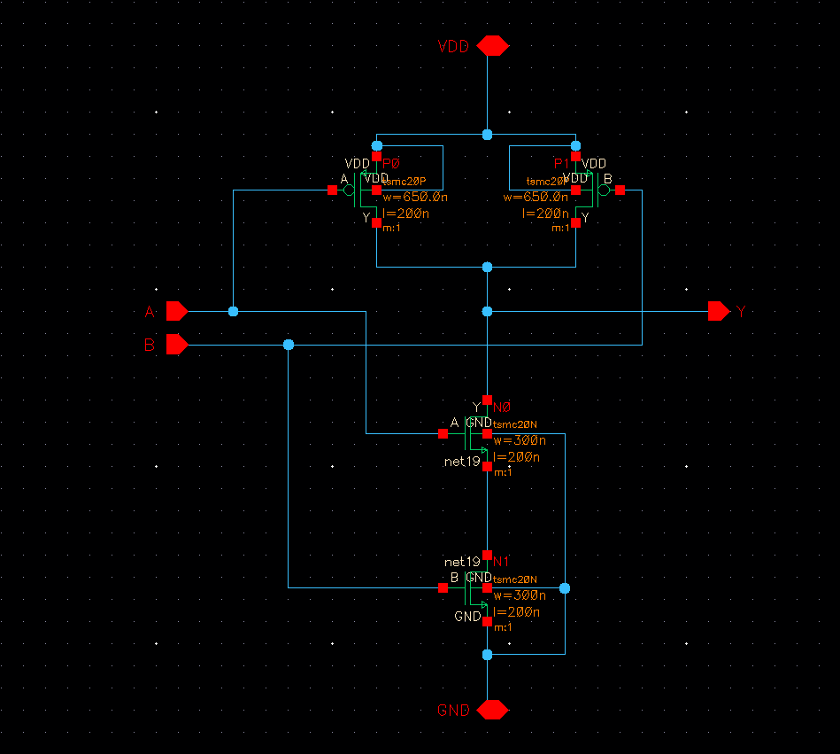
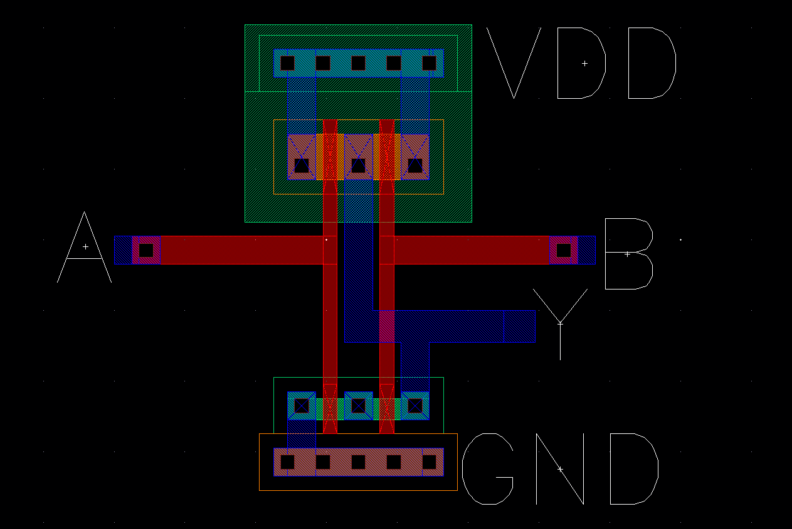
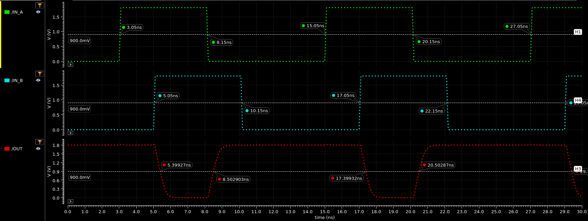

## SCHEMATIC

## LAYOUT

## TIME DELAYS

| Rising Delay (ns) | Falling Delay (ns) | % Error |
|     :------:      |       :------:     |  :---:  |
| 0.3529 | 0.3493 | 1.03% |

## POWER DISSIPATION

| Power Source | Value (uW) |
|    :----:    | :---: |
| VDC | -11.74 |
| IN_A | -0.1363 |
| IN_B | -0.1311 |
