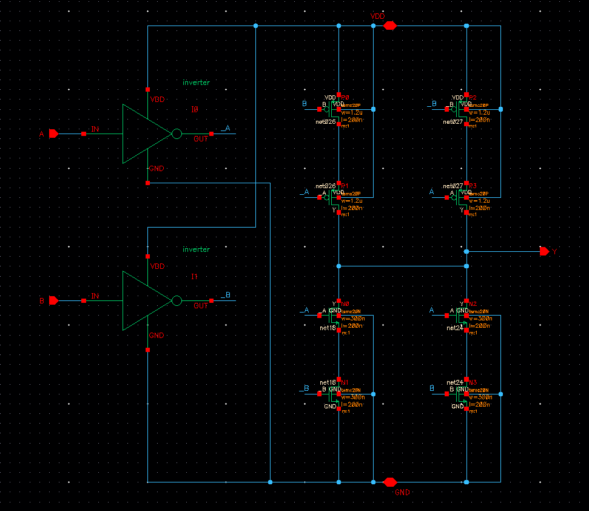
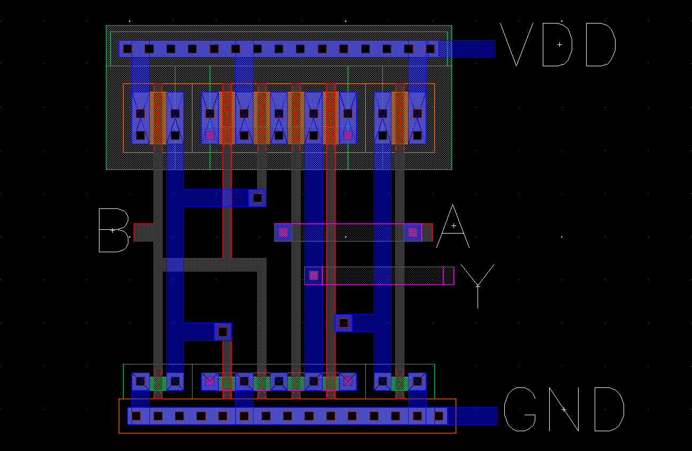
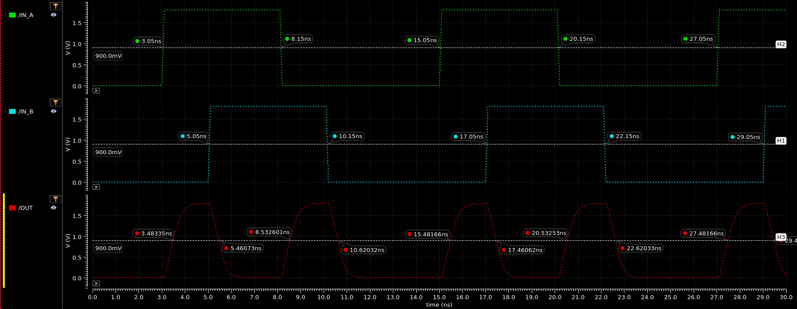

## SCHEMATIC

## LAYOUT

## TIME DELAYS

| Rising Delay (ns) | Falling Delay (ns) | % Error |
|     :------:      |       :------:     |  :---:  |
| 0.4334 | 0.4107 | 5.53% |

## POWER DISSIPATION

| Power Source | Value (uW) |
|    :----:    | :---: |
| VDC | -36.29 |
| IN_A | -0.3 |
| IN_B | -0.3236 |
