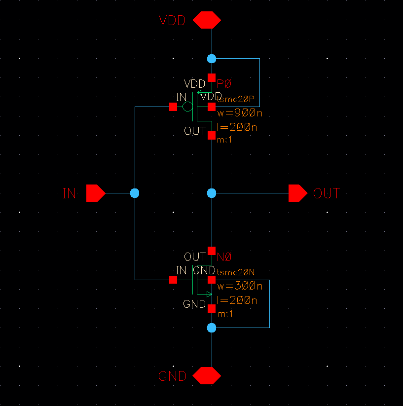
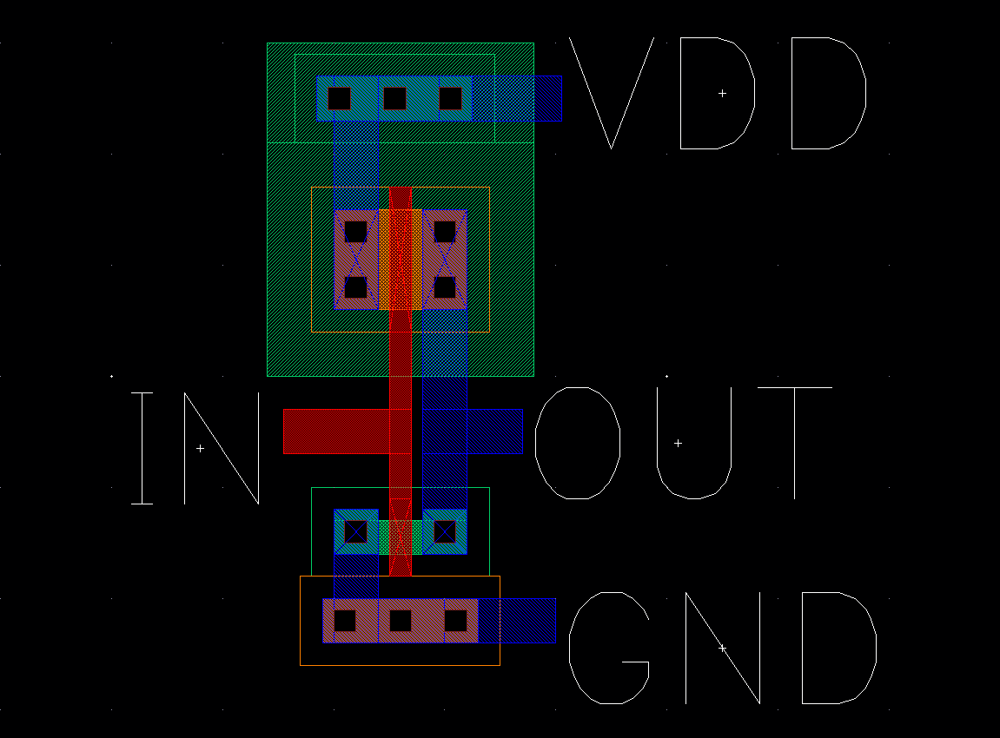
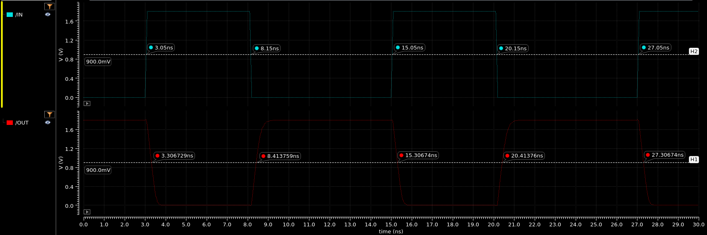

## SCHEMATIC

## LAYOUT

## TIME DELAYS

| Rising Delay (ns) | Falling Delay (ns) | % Error |
|     :------:      |       :------:     |  :---:  |
| 0.2638 | 0.2567 | 2.77% |

## POWER DISSIPATION

| Power Source | Value (uW) |
|    :----:    | :---: |
| VDC | -11.58 |
| IN | -0.1814 |
