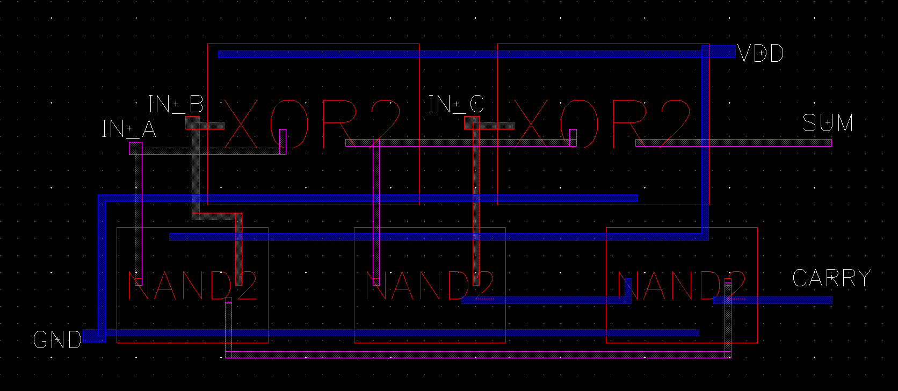
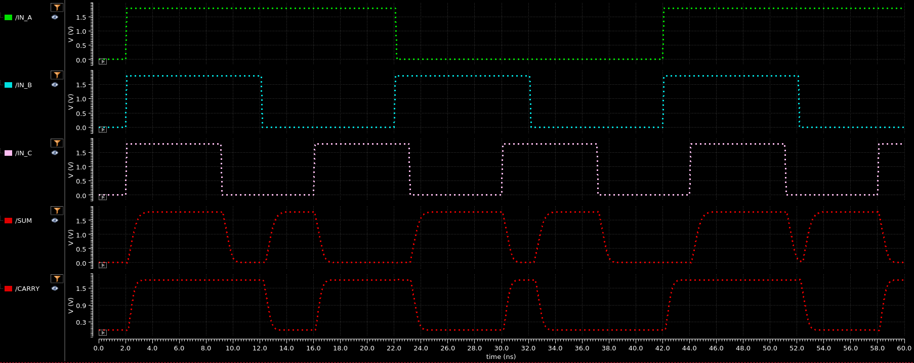

## SCHEMATIC

## LAYOUT

## TIME DELAYS

| Output | Rising Delay (ns) | Falling Delay (ns) | % Error |
| :----: |     :------:      |       :------:     |  :---:  |
| SUM | 0.6769 | 0.6326 | 7.00% |
| CARRY | 0.4109 | 0.4543 | 10.6% |

## POWER DISSIPATION

| Power Source | Value (uW) |
|    :----:    | :---: |
| VDC | -110.5 |
| IN_A | -0.7606 |
| IN_B | -0.8067 |
| IN_C | 0.1900 |

## MAX FREQUENCY

| Max Period | 14ns |
| Max Frequency | 71MHz |
| :---: | :---: |
