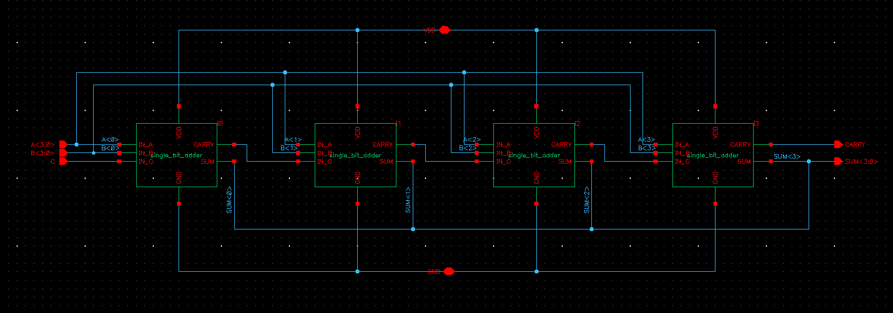
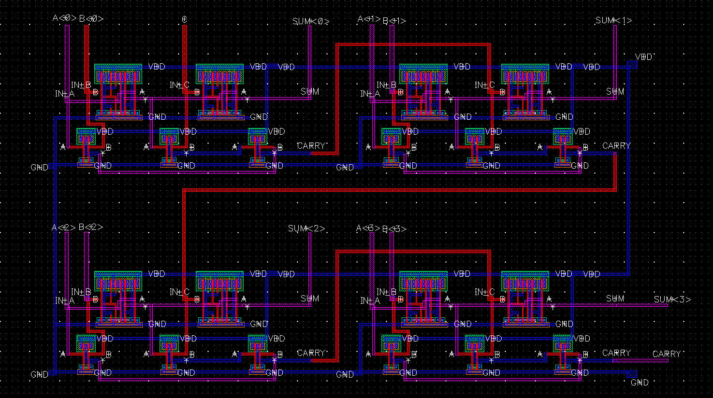
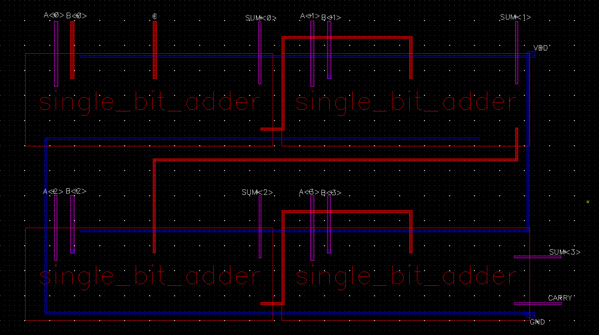
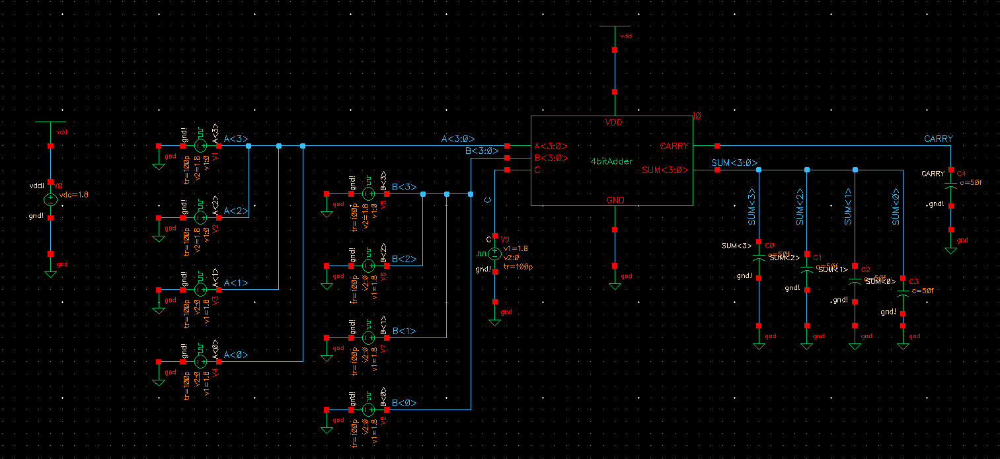

## SCHEMATIC

## LAYOUT

## SIMULATION

For input voltages (vpulse) set all to the same delay, same pulse width and period from the max frequency calculated in Lab4. 
In the properties of the vpulse, the 'Voltage 2' value should be 1.8V if the input bit is 1, 0V if bit is 0.
The value for 'Voltage 1' will be 0V if 'Voltage 2' is 1.8V, and vice versa.
