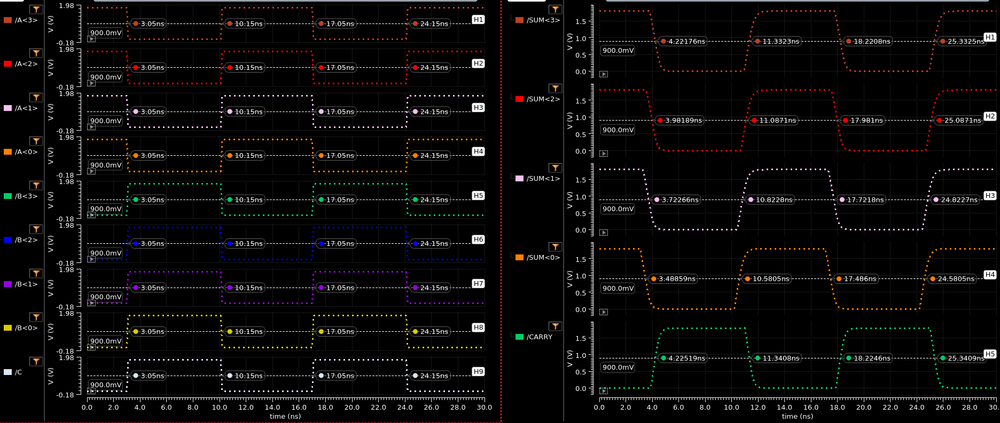

## TIME DELAY

| Output | Rising Delay (ns) | Falling Delay (ns) | % Error |
| :----: | :----: | :----: | :----: |
| SUM<3> | 1.182 | 1.172 | 0.85% |
| SUM<2> | 0.937 | 0.932 | 0.54% |
| SUM<1> | 0.6728 | 0.6727 | 0.02% |
| SUM<0> | 0.4305 | 0.4386 | 1.88% |
| CARRY | 1.175 | 1.191 | 1.36% |

## POWER DISSIPATION
| Voltage Source | Value (uW) |
| :----: | :----: |
| VDD | -115.8 |
