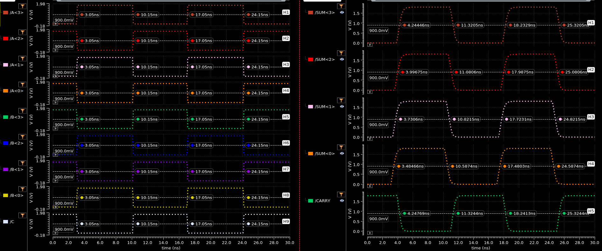

## TIME DELAY

| Output | Rising Delay (ns) | Falling Delay (ns) | % Error |
| :----: | :----: | :----: | :----: |
| SUM<3> | 1.194 | 1.171 | 1.96% |
| SUM<2> | 0.9468 | 0.9306 | 1.74% |
| SUM<1> | 0.6806 | 0.6715 | 1.36% |
| SUM<0> | 0.4347 | 0.4374 | 0.62% |
| CARRY | 1.174 | 1.198 | 2.04% |

## POWER DISSIPATION
| Voltage Source | Value (uW) |
| :----: | :----: |
| VDD | -115.7 |
