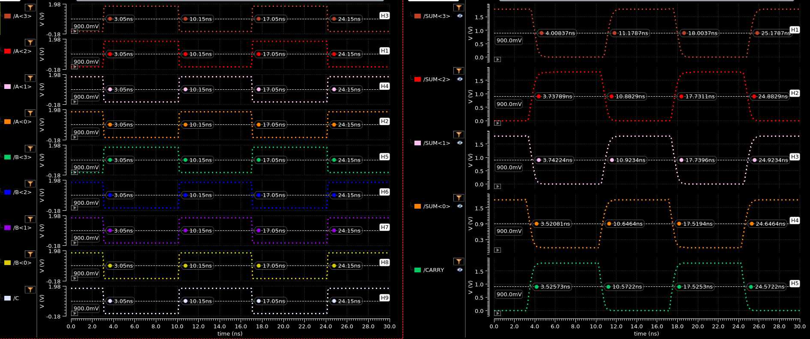

## TIME DELAY

| Output | Rising Delay (ns) | Falling Delay (ns) | % Error |
| :----: | :----: | :----: | :----: |
| SUM<3> | 1.029 | 0.958 | 7.41% |
| SUM<2> | 0.6879 | 0.7329 | 6.54% |
| SUM<1> | 0.7734 | 0.7329 | 11.7% |
| SUM<0> | 0.4964 | 0.4708 | 5.44% |
| CARRY | 0.4757 | 0.4222 | 12.7% |

## POWER DISSIPATION
| Voltage Source | Value (uW) |
| :----: | :----: |
| VDD | -119.1 |
