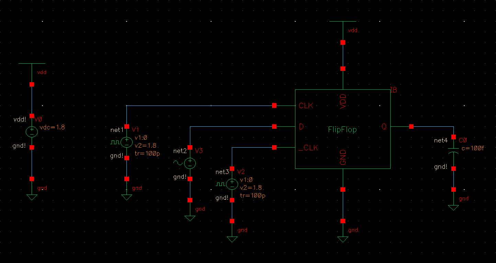
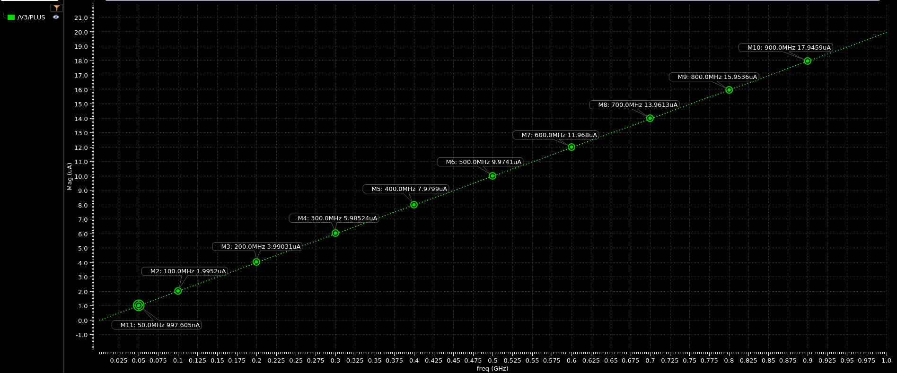

## SCHEMATIC

## INPUT CAPACITANCE

|  Frequency (MHz)  |  Ifrequency (uA)  |  Capacitance (fF)  |
|     :-------:     |      :------:     |      :-------:     |
|  50  |  0.9976  |  3.1755  |
|  100  |  1.9952  |  3.1755  |
|  200  |  3.9903  |  3.1754  |
|  300  |  5.9852  |  3.1752  |
|  400  |  7.9799  |  3.1751  |
|  500  |  9.9741  |  3.1749  |
|  600  |  11.96  |  3.1725  |
|  700  |  13.961  |  3.1742  |
|  800  |  15.954  |  3.1739  |
|  900  |  17.946  |  3.1735  |

Sink Capacitance: 3.175 fF
