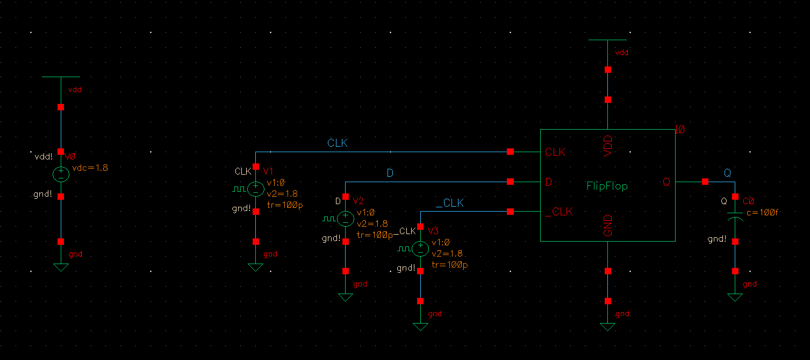
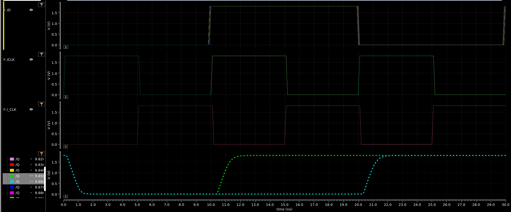
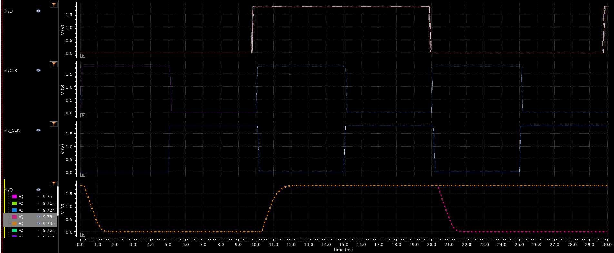

## SCHEMATIC

## SETUP TIME

#### SETUP RISE

#### SETUP FALL

setup_rise = CLK_rise - Q_rise = 10 - 9.85 = 0.15ns

setup_fall = CLK_fall - Q_fall = 20 - (10 + 9.73) = 0.27ns

setup_fall > setup_rise --> setup time = 0.27ns
