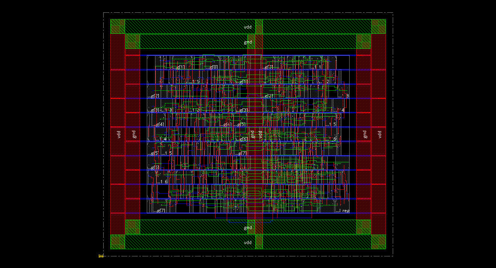

## DETAIL ROUTING
### STANDARD CELLS
```
#std cell=302 (0 fixed + 302 movable) #block=0 (0 floating + 0 preplaced)
#ioInst=0 #net=323 #term=1008 #term/net=3.12, #fixedIo=0, #floatIo=0, #fixedPin=0, #floatPin=26
stdCell: 302 single + 0 double + 0 multi
Total standard cell length = 1.0808 (mm), area = 0.0108 (mm^2)
Estimated cell power/ground rail width = 0.781 um
Average module density = 0.713.
Density for the design = 0.713.
       = stdcell_area 1351 sites (10808 um^2) / alloc_area 1896 sites (15168 um^2).
Pin Density = 0.5207.
            = total # of pins 1008 / total area 1936.
```

### TOTAL WIRELENGTH and VIAS
```
#Complete Global Routing.
#Total wire length = 9148 um.
#Total half perimeter of net bounding box = 10143 um.
#Total wire length on LAYER metal1 = 255 um.
#Total wire length on LAYER metal2 = 2938 um.
#Total wire length on LAYER metal3 = 3705 um.
#Total wire length on LAYER metal4 = 1500 um.
#Total wire length on LAYER metal5 = 750 um.
#Total wire length on LAYER metal6 = 0 um.
#Total number of vias = 1572
#Up-Via Summary (total 1572):
#           
#-----------------------
# metal1            908
# metal2            461
# metal3            154
# metal4             49
#-----------------------
#                  1572 
```

## LAYOUT

