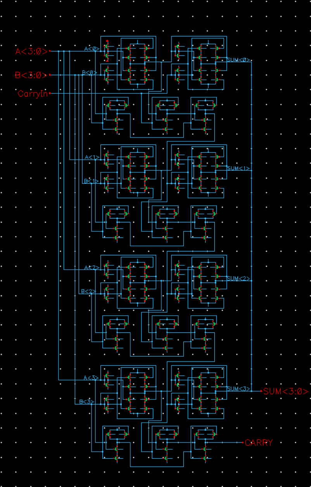
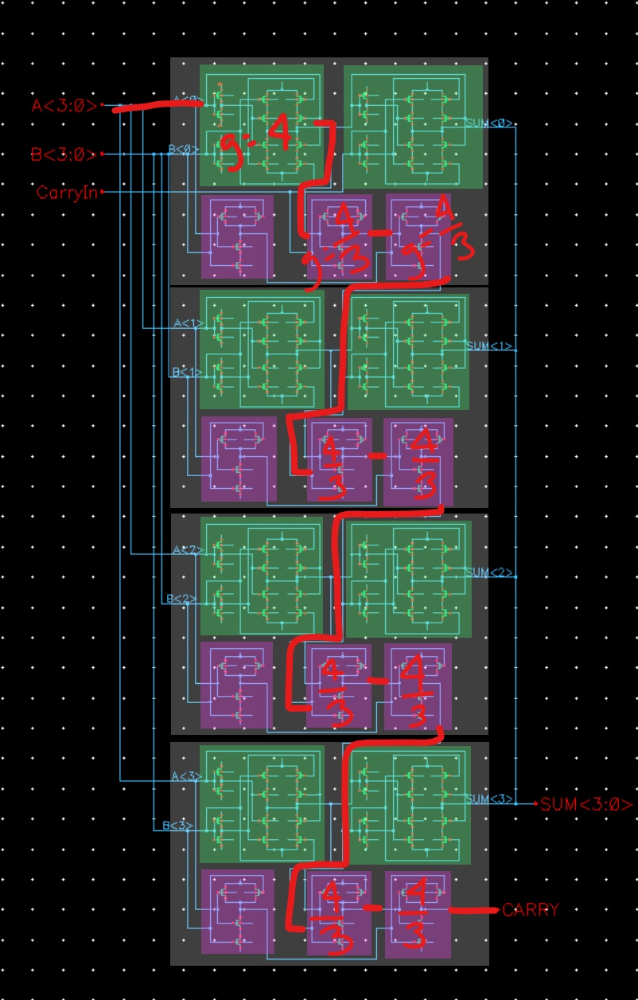
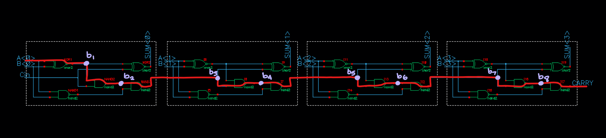

## 4-bit Adder Schematic Transistor Level

## 4-bit Adder Critical Path

## CALCULATIONS

 Capacitance of [XOR2 gate](https://github.com/99hhernandez/ECEN454/tree/main/Lab03/XOR2) and [NAND2 gate](https://github.com/99hhernandez/ECEN454/tree/main/Lab03/NAND2) come from the calculated values from Lab 3.

### Path Logical Effort (G)
%5E%7B8%7D=4%5Cbig(%5Cfrac%7B4%7D%7B3%7D%5Cbig)%5E%7B8%7D=39.95)
 The logical effort of a gate with given inputs can be found on Table 1.1 in Page 7 [here](https://my.eng.utah.edu/~cs6710/handouts/Sutherland_Ch1.pdf).

### Path Electrical Effort (H)

### Path Branching Effort (B)
%5E%7B4%7D%20%5Cbig(%5Cfrac%7BC_%7BNAND2%7D%7D%7BC_%7BNAND2%7D%7D%5Cbig)%5E%7B4%7D=(4.1%5E%7B4%7D)(1%5E%7B4%7D)=282.6)
  
### Stage Effort (\hat{f})
%5E%7B%5Cfrac%20%7B1%7D%7BN%7D%7D=43578.9%5E%7B%5Cfrac%20%7B1%7D%7B9%7D%7D=3.28%20) 

### Transistor Resizing
If 2.7 <= f/hat <= 4, great, if not then you need to change B by resizing gates outside the critical path. If your f/hat falls within range, then start from the end of the critical path and calculate Cin,i for each gate, making your way to the beginning of the critical path. If your Cin,i <= Cgate, dont resize, else resize the transistors by the multiplier you get from Cin,i / Cgate.

